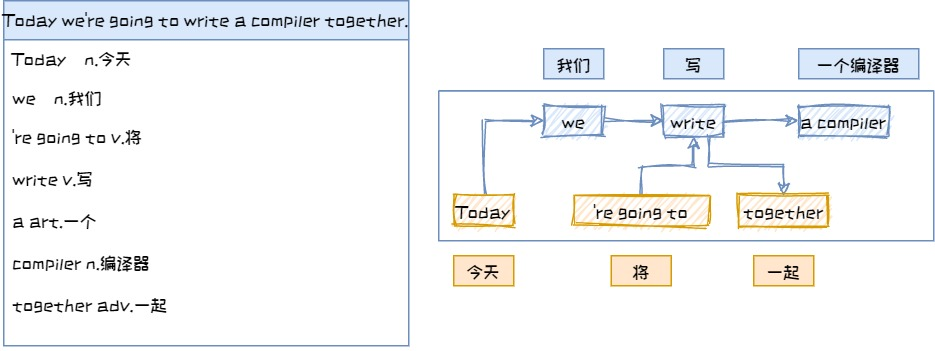
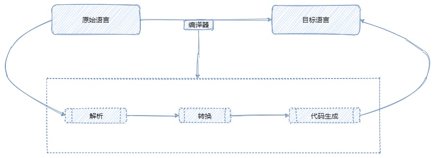
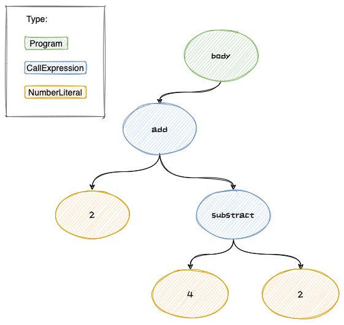
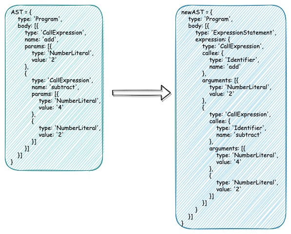
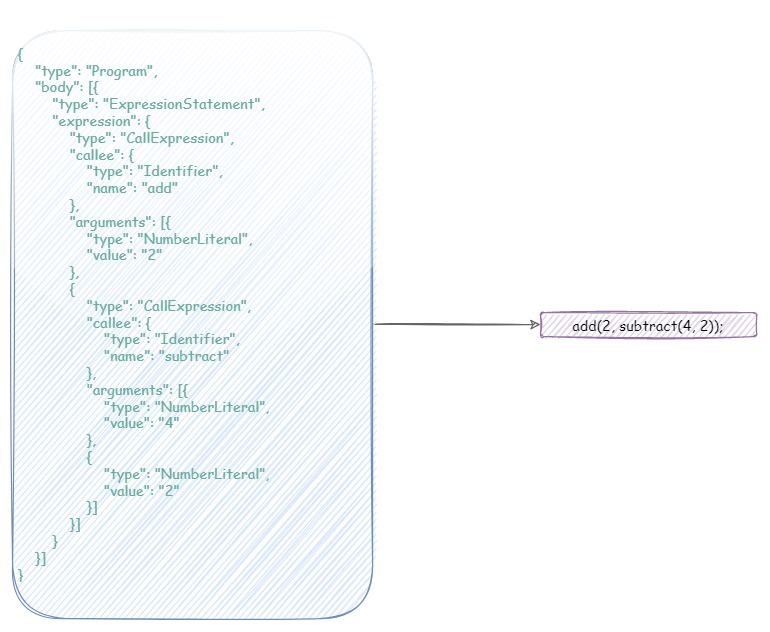

# my-tiny-compiler
迷你编译器

原版项目：https://github.com/jamiebuilds/the-super-tiny-compiler

本项目是对`the-super-tiny-compiler`的精简实现，便于个人学习编译器的设计思路。

如有错漏请多指教~~~


以下为正文：

---

目录
1. 什么是编译器
2. 编译原理及其实现
  - 2.1 解析(Parsing)
    - 2.1.1 词法分析
    - 2.1.2 句法分析
  - 2.2 转换(Transformation)
  - 2.3. 目标代码生成(Code Generation)
3. The super tiny compiler

---

## 1. 什么是编译器
回想一下翻译英文的过程，当你拿到这样一个句子的时候，你会怎么翻译？

`Today we're going to write a compiler together.`

首先，你肯定得认识这个句子里的每个单词，并且要知道每个词的词性，比如是名词还是动词；

其次，你还得知道英文的语法规则，比如主谓宾，比如不定冠词 `a`后面要跟名词等；

最后，连词成句，将翻译后的单词和短句连起来，并调整一下语序、增减一些标点符号或单词，来让整个句子通顺：

`今天，我们将一起写一个编译器。`




编译器，实际上就是**将一种语言翻译成另一种语言**的程序。

## 2. 编译原理

在代码世界里，大部分编译器的工作过程都与上面所举的翻译例子类似，可以分解为三个阶段：
1. 解析(Parsing)
2. 转换(Transformation)
3. 目标代码生成(Code Generation)




### 2.1 解析(Parsing)
解析阶段通常分为`词法分析`(Lexical Analysis)和`句法分析`(Syntactic Analysis)。

#### 2.1.1 词法分析
词法分析会先将原始代码(**输入**)分解成一个个的 `词`或 `符号`，即所谓的 `词法单元`(token)。

类比英文翻译的例子，就是把其中的单词一个个取出来，并确定单词的词性和中文意思。

一个词法单元(token)通常包含两个部分：类别 `type`和值 `value`。

常见的type有：常量(如123，"hello"等)、关键字(if, else, break等)、操作符(+, -, %等)、分隔符(括号, 分号等)。

我们今天要实现的编译器就不做这么多类型了，只解析以下三种：
- paren：即parenthesis，分隔符
- name：方法名
- number：数字常量

以Lisp语言为例：
```Lisp
(add 2 (subtract 4 2))
```
词法分析结果如下：

| type |value|
| --- | --- |
|paren|(|
|name|add|
|number|2|
|paren|(|
|name|subtract|
|number|4|
|number|2|
|paren|)|
|paren|)|

实际上这句代码里还有几个空格，但是空格并没有实际意义，只起到分隔单词的作用，在解析的时候直接跳过即可，不需要析出。


实现思路：

首先，从左到右**遍历**整句代码，然后把句子里的**词法单元**一个个**取出**来，再判断该词法单元的**类型**。

词法单元类型判断(基本都是正则)：

- 空格：`/\s/`
- number：`/[0-9]/`，可能有多个数字字符连起来组成一个number类型的词法单元，因此需向后继续遍历，直到全部取出（比如，"123"是由3个数字字符组成的数字词法单元）
- name：`/[a-z]/i`，同number需向后遍历全部取出
- paren：这里实际上就只有左括号和右括号两种，所以直接 `===`判断即可。

代码实现：
```js
let current = 0; // 当前遍历的下标
let tokens = []; // 用于保存词法单元的数组
while (current < input.length) {
     // 用正则取出词法单元
     
     let char = input[current]; // 当前字符
     
     // 1、匹配左括号
     if (char === '(') {
         tokens.push({
            type: 'paren',
            value: '(',
         });
         current++;
         continue;
     }
     // 2、匹配右括号
     if (char === ')') {
          tokens.push({
            type: 'paren',
            value: ')',
          });
          current++;
          continue;
    }
    // 3、匹配并跳过空格
    let WHITESPACE = /\s/;
    if (WHITESPACE.test(char)) {
      current++;
      continue;
    }
    // 4、匹配number
    let NUMBERS = /[0-9]/;
    if (NUMBERS.test(char)) {
        let value = '';
        // 数字可能是由多个数字字符组成，如数字123有3个数字字符，所以这里需要遍历全部取出
        while (NUMBERS.test(char)) {
            value += char;
            char = input[++current];
        }
        tokens.push({
            type: 'number',
            value
        });
        continue;
    }
    // 5、匹配name
    let LETTERS = /[a-z]/i;
    if (LETTERS.test(char)) {
      let value = '';
      // 和number一样，可能是多个字母组成的name，如add是由a,d,d三个字母组成的，需要遍历取出
      while (LETTERS.test(char)) {
        value += char;
        char = input[++current];
      }
      tokens.push({
        type: 'name',
        value
      });
      continue;
  }
}
```
封装成函数（省略上述具体正则代码）：
```js
function tokenizer(input) {
    let current = 0; // 当前遍历的下标
    let tokens = []; // 用于保存词法单元的数组
    while (current < input.length) {
        // 1、匹配左括号
        // 2、匹配右括号
        // 3、并跳过空格
        // 4、匹配number
        // 5、匹配name
        ......
        
        return tokens;
    }
}
```
实际上，在做词法分析的时候，有可能会解析出错，比如非法字符，此时就应抛出错误：`throw new TypeError('I dont know what this character is: ' + char);`。（注：后续步骤中同样应有错误处理，本文都作了省略，只关注原理部分。）

#### 2.1.2 句法分析
经过上面的词法分析，我们已经将原始代码语句拆分成了一个个的词法单元。若要重新组合成符合目标语言语法的句子，还需要对原来的句子结构进行调整（比如适当增加或删除分隔符、关键字转换等）。

类比英文翻译的例子，就是把翻译成中文的单词重新组合成一个中文句子，要在保留原意的同时，还要让句子读起来通顺，符合中文的语法。

因此，为了便于之后翻译成目标语言，我们需将上面(2.1.1)词法分析得到的数组tokens，组装成一棵 `抽象语法树(AST)`，再对这棵 `树`进行节点操作。

##### 什么是 `抽象语法树`？

抽象语法树就是以树形结构表示代码，树上的每个节点对应代表着代码中的词法单元。之所以是“抽象”的，是因为这里的语法并不会表示出真实语法中出现的每个细节，换句话说就是，**不是所有的词法单元都会被表示成树节点**。比如括号，会被隐含在树的结构中，而不会被表示为树节点。

##### 为什么要用 `抽象语法树`？

抽象语法树有两个特点：
1）不依赖于具体的文法；
2）不依赖于语言的细节。

使用抽象语法树，可以**让编译器摆脱特定文法或语言的桎梏**，比如现在是把Lisp语言编译成C，如果之后想编译成Java或者JS，我们就可以复用之前的AST，而不用每增加一种目标语言就得重新写一个句法分析程序。

##### 如何解析出 `抽象语法树`？

2.1.1节词法分析得到的数组如下：
```js
const tokens = [
  { type: 'paren',  value: '('        },
  { type: 'name',   value: 'add'      },
  { type: 'number', value: '2'        },
  { type: 'paren',  value: '('        },
  { type: 'name',   value: 'subtract' },
  { type: 'number', value: '4'        },
  { type: 'number', value: '2'        },
  { type: 'paren',  value: ')'        },
  { type: 'paren',  value: ')'        }
];
```
句法分析后要得到的AST如图所示：




解析方法：

- 用JSON对象来表示树；
- 树中的每一个节点都是一个对象；
- 树的根节点对象定义两个属性：类型type，值为Program；树体body，值为一个数组，里面是程序中一句句代码所对应的对象；
- tokens中，name类型的词法单元，转换成对象后有三个属性：type、name、params。其中，type的值定义为CallExpression，表示这是一个函数表达式；name的值就是对应词法单元的value，表示具体的函数名称，比如`add`；params是一个数组，里面是函数的具体参数对象（可能是数字，也可能是另一个函数表达式）。
- tokens中，number类型的词法单元，转换成对象后有两个属性：type和value。type定义为NumberLiteral，value是对应词法单元的value；
- 遍历词法单元数组tokens，如果是name或者number类型，直接生成树的子节点（一个包含上述属性的对象）；如果是括号，则需要对括号之间的内容进行**递归**调用解析函数，对应生成一棵子树。


代码实现：
```js
let token = tokens[current];
// 处理number类型，直接返回子节点
if (token.type === 'number') {
    current++;
    return {
        type: 'NumberLiteral',
        value: token.value,
    };
}
// 处理string类型，直接返回子节点
if (token.type === 'string') {
    current++;
    return {
        type: 'StringLiteral',
        value: token.value,
    };
}
// 处理括号内的内容
if (token.type === 'paren' && token.value === '(') {
    token = tokens[++current];
    let node = {
        type: 'CallExpression',
        name: token.value,
        params: [],
    };
    token = tokens[++current];
    while ((token.type !== 'paren') || (token.type === 'paren' && token.value !== ')')
      ) {
      // TODO：此处需递归调用自身，见下方函数封装
      node.params.push(递归调用当前解析方法生成的子树);
      token = tokens[current];
    }
    current++;
    return node;
}
```
封装成 `walk()`函数，便于递归调用：
```js
function parser(tokens) {
    function walk() {
        // 省略上面部分具体代码
        // 处理number类型，直接返回子节点
        // 处理string类型，直接返回子节点
        // 处理括号内的内容
        ...
        // DONE: 递归调用生成子树
        node.params.push(walk());
        ...
    }
    
     let ast = {
        type: 'Program',
        body: [],
      };
      let current = 0;
      while (current < tokens.length) {
        ast.body.push(walk());
      }
      return ast;
}
```
生成的AST：
```js
ast = {
  type: 'Program',
  body: [{
    type: 'CallExpression',
    name: 'add',
    params: [
      {
        type: 'NumberLiteral',
        value: '2'
      },
      {
        type: 'CallExpression',
        name: 'subtract',
        params: [
          {
            type: 'NumberLiteral',
            value: '4'
          },
          {
            type: 'NumberLiteral',
            value: '2'
          }]
      }]
  }]
}
```

### 2.2 转换(Transformation)
经过2.1节的分析，我们得到了一棵Lisp代码的抽象语法树，这一节，我们就要对这棵树进行修剪，进而转换成目标语言(C语言)代码。

逆向思维一下，这一步和上一步都是生成一棵抽象语法树，只不过2.1节生成的语法树是对Lisp代码的抽象，而本节要生成的语法树则是对C代码的抽象。如果将这个过程倒转过来，将C代码编译成Lisp代码，那么我们也同样需要先将C代码抽象成一棵语法树。

C代码：
```c
add(2, subtract(4, 2));
```

词法分析得到tokens：

|type|value|
| --- | --- |
|name|add|
|paren|(|
|number|2|
|number|,|
|name|subtract|
|paren|(|
|number|4|
|paren|,|
|number|2|
|paren|)|
|paren|)|
|paren|;|

注意到C比Lisp多了两种分隔符：`,`和 `;`。

句法分析生成AST：
```js
newAST = {
  type: 'Program',
  body: [{
    type: 'ExpressionStatement',
    expression: {
      type: 'CallExpression',
      callee: {
        type: 'Identifier',
        name: 'add'
      },
      arguments: [
        {
          type: 'NumberLiteral',
          value: '2'
        }, {
          type: 'CallExpression',
          callee: {
            type: 'Identifier',
            name: 'subtract'
          },
          arguments: [{
            type: 'NumberLiteral',
            value: '4'
          }, {
            type: 'NumberLiteral',
            value: '2'
          }]
        }]
    }
  }]
}
```
对比两棵抽象语法树代码：


- body中的对象最外层加了一层封装，type为ExpressionStatement，expression是左边AST的body中的对象；
- CallExpression类型的name属性也加了一层封装，变为对象callee；
- params变为arguments；
- 其余保持不变。

#### 代码实现思路

对于body中的节点进行递归深度遍历，当type为CallExpression的name属性的加一层对象，变为calle；params中的参数如果是嵌套表达式，则递归生成子树。
```js
switch (node.type) {
      case 'CallExpression':
        newNode.type = node.type
        // name加一层对象封装
        const callee = {
          type: 'Identifier',
          name: node.name
        }
        newNode.callee = callee

        // 处理params
        const arguments = []
        node.params.forEach(item => {
        // TODO: 递归生成子树
        // arguments.push(...)
        })
        newNode.arguments = arguments
        break
      case 'NumberLiteral':
        newNode = {
          type: 'NumberLiteral',
          value: node.value,
        }
        break
      default:
        throw new TypeError(node.type)
    }
```
封装成函数，便于递归调用：
```js
function traverseNode(node, newNode) {
    switch (node.type) {
    // ...省略上面部分具体代码
    
    // 处理params
        const arguments = []
        // DONE：递归生成子树
        node.params.forEach(item => {
          arguments.push(traverseNode(item, {}))
        })
        newNode.arguments = arguments
        break
        
        // ...
    }

    return newNode
  }
```

最后对ast的body进行遍历：
```js
  let newAst = {
    type: 'Program',
    body: [],
  }

ast.body.forEach(node => {
      // 每个node加一层封装
      const newAstNode = {
        type: 'ExpressionStatement',
        expression: {}
      }
      traverseNode(node, newAstNode.expression)
      newAst.body.push(newAstNode)
})
```
newAst就是转换后的抽象语法树。


注释：很多编译器在这一步会用到**访问者模式(Visitor Pattern)**，我们的编译器这里只是简单地实现了功能，没有采用设计模式，这里就不展开了(实际上是因为太难还没搞明白 :)


### 2.3. 目标代码生成(Code Generation)

最后，就是根据newAst生成目标代码。



思路：
深度遍历抽象语法树，递归实现。

代码实现：
```js
function codeGenerator(node) {
  switch (node.type) {
    case "Program":
      // 程序中可能有多行代码，每行后面加换行符
      const code = node.body.map(codeGenerator).join("\n")
      return code
    case "ExpressionStatement":
      // 每行代码后面加分号
      return codeGenerator(node.expression) + ";";
    case "CallExpression":
      // 每个函数表达式由 "方法名"+"("+"参数1,参数2,...,参数n"+)
      // 多个参数用逗号连接
      return codeGenerator(node.callee) + "(" + node.arguments.map(codeGenerator).join(", ") + ")"
    case "Identifier":
      // 直接返回方法名称
      return node.name
    case "NumberLiteral":
      // 直接返回数值
      return node.value
    default:
      throw new TypeError(node.type)
  }
}
```

转换结果：

|LISP|C|
| --- | --- |
|(add 2 2)|add(2, 2)|
|(subtract 4 2)|subtract(4, 2)|
|(add 2 (subtract 4 2))|add(2, subtract(4, 2))|


## 3. The super tiny compiler

这个编译器的原版是The super tiny compiler，地址：[https://github.com/jamiebuilds/the-super-tiny-compiler](https://github.com/jamiebuilds/the-super-tiny-compiler)。

墙裂推荐阅读源码，第一次看到这么保姆级的代码注释，代码本身也思路清晰通俗易懂，去掉注释全部代码也就两百多行，真正的深入浅出，膜拜大佬~

我的复刻简化版本在这里：[https://github.com/youzouzou/my-tiny-compiler](https://github.com/youzouzou/my-tiny-compiler)。

欢迎探讨学习。

---


参考资料：

[1] [The Super Tiny Compiler](https://github.com/jamiebuilds/the-super-tiny-compiler)

[2] [Redy语法分析－－抽象语法树简介](http://blog.chinaunix.net/uid-26750235-id-3139100.html)

[3] [访问者模式](https://blog.csdn.net/da_kao_la/article/details/104307725)